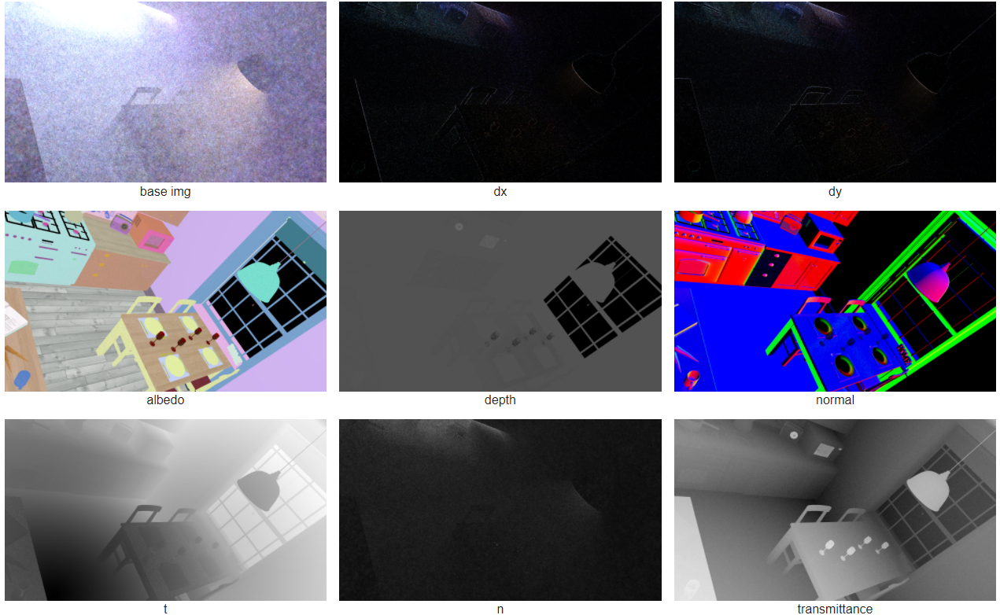

# VolGradNet
This is the implementation of Pacific Graphics 2020 paper: **Unsupervised Image Reconstruction for Gradient-Domain Volumetric Rendering** for reference only.

Thanks **Jie Guo** and **Mengtian Li** for their generous help of sending the GradNet source code to me. This project contains a part of GradNet source code.

## Environment
- Python 3.7
- PyTorch 1.3.1

## Dataset
The training dataset was rendered by a modified [GVPM](https://github.com/gradientpm/gvpm) code. We extract the normal, depth and albedo from the first diffuse surface hit by camera ray. 
It will be easy to modify if you are familiar with the volumetric photon density estimation pipeline.

## Disclaimer
This code was rewritten for open-sourcing and is not fully tested yet.
